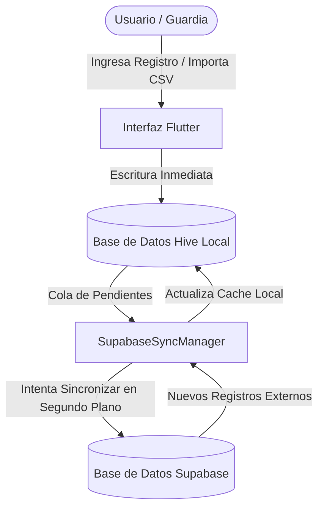

# Control de Acceso (Acceso/Sbox)

Aplicación móvil nativa en Flutter diseñada para la administración y control de acceso vehicular y peatonal. El sistema está optimizado para funcionar sin conexión a internet (**offline-first**) y sincronizarse de manera bidireccional y automática con la nube cuando detecta conexión.

---

## 🛠️ Arquitectura y Flujo de Sincronización

La aplicación utiliza un esquema de base de datos híbrido local-nube:
* **Base de datos local:** **Hive** (Cajas NoSQL ligeras y de lectura ultra-rápida).
* **Base de datos en la nube:** **Supabase** (PostgreSQL administrado).

### Diagrama de Flujo de Datos



### Detalle de Almacenamiento Local (Hive Boxes)
1. `records_box`: Registro histórico de accesos concedidos e ingresos/salidas en el recinto.
2. `pre_auth_box`: Listado de visitas pre-autorizadas creadas por la administración o residentes.
3. `blacklist_box`: Listado de personas o vehículos restringidos para ingresar.
4. `sync_metadata_box`: Metadatos de control (timestamps) para calcular deltas de sincronización.

---

## 🚀 Funcionalidades Clave

* **Importación Masiva de Datos:** Soporte para subir archivos CSV (con delimitador auto-detectado `,` o `;`) para poblar listas de pre-autorizaciones y listas negras.
* **Escaneo QR y Patentes:** Cámara integrada para leer códigos de pre-autorizaciones o capturar fotografías de registros.
* **Control de Roles:** Niveles de accesos delimitados por claves fijas locales:
  * `admin123` ➔ **Administrador** (Acceso completo, creación, edición, eliminación y exportación).
  * `guardia123` ➔ **Operador Guardia** (Lectura, registro de accesos y escaneo).
  * `cliente123` ➔ **Vista Cliente** (Solo lectura y exportación).
* **Resiliencia Offline:** Almacenamiento local persistente garantizado; no hay pérdida de información si la red colapsa en el punto de control.

---

## 💻 Desarrollo y Compilación

### Requisitos Previos
* **Flutter SDK:** `^3.12.0`
* **Android SDK:** Compila contra el SDK `36` (requerido por dependencias de ciclo de vida).

### Comandos Clave

**1. Obtener dependencias:**
```bash
flutter pub get
```

**2. Ejecutar análisis estático:**
```bash
flutter analyze
```

**3. Compilar en modo desarrollo (debug):**
```bash
flutter run
```

**4. Compilar APK optimizado para Producción (Release):**
```bash
flutter build apk --release
```
*El archivo de salida se genera en `build/app/outputs/flutter-apk/app-release.apk`.*
